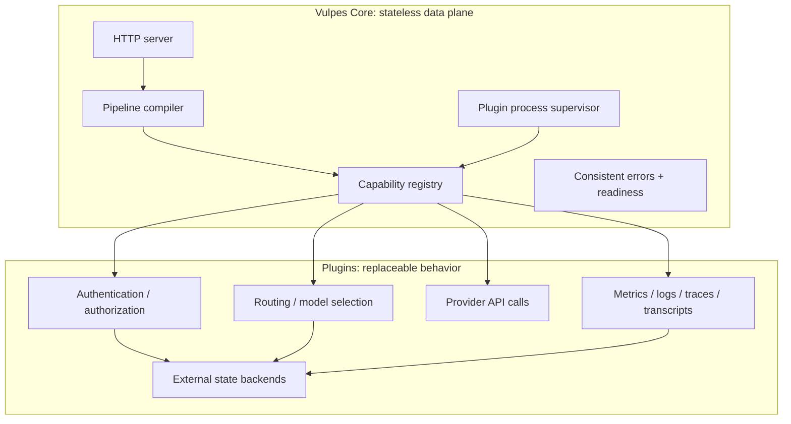
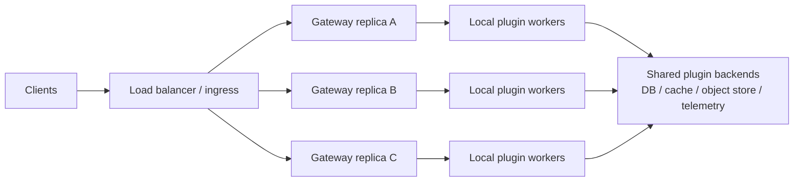

# Vulpes Core LLM Gateway

Vulpes Core is a small, stateless, OpenAI-compatible LLM gateway. It owns the HTTP data plane, request normalization, routing/fallback orchestration, streaming, plugin lifecycle, readiness, and error mapping. Everything stateful or provider-specific lives behind strict plugin capabilities.

The design goal is simple: keep the gateway core boring and predictable, while letting operators swap authentication, routing, providers, observability, prompt management, cache, and rate-limit behavior without recompiling the core.

## What is in this repository

- OpenAI-compatible chat completion endpoint.
- Health and readiness endpoints.
- Deterministic request pipeline compilation from YAML config.
- Strict capability interfaces for external plugins.
- Filesystem and GitHub plugin source resolvers.
- Plugin process supervision over local Unix sockets.
- Routing and fallback execution.
- Streaming/SSE coordination.
- Async observer queue for metrics, traces, logs, and audit sinks.
- Tests, examples, protocol definitions, and Nix packaging helpers.

Community and production plugins live outside the core repository. See [`vulpes-core-plugins`](https://github.com/FenkoHQ/vulpes-core-plugins) for the reference plugin set.

## How requests flow

```mermaid
flowchart LR
    Client["Client / SDK"] --> HTTP["OpenAI-compatible HTTP API"]
    HTTP --> Normalize["Normalize request\nassign request_id + deadline"]
    Normalize --> AuthN["Authenticator capability"]
    AuthN --> AuthZ["Authorizer capability\noptional"]
    AuthZ --> Prompt["PromptProvider capability\noptional"]
    Prompt --> CacheLookup["Cache lookup\noptional"]
    CacheLookup --> RateLimit["RateLimiter capability\noptional"]
    RateLimit --> Router["Router capability"]
    Router --> Upstream["UpstreamProvider capability"]
    Upstream --> Fallback{"Fallback needed?"}
    Fallback -- yes --> Upstream
    Fallback -- no --> Response["OpenAI-compatible response\nor SSE stream"]
    Response --> Observers["Observer events\nasync by default"]
    Observers --> Sinks["Metrics / logs / traces / audit stores"]
```



## Core versus plugins



## High availability model

Vulpes Core does not run a cluster protocol. Run multiple gateway replicas behind a load balancer, service mesh, ingress controller, or platform-native service. Each replica starts its own local plugin workers. Shared state belongs in plugin backends such as Postgres, Redis, S3-compatible object storage, OTLP collectors, or policy engines.



## Quickstart

Run the test suite:

```bash
go test ./...
```

Start the gateway with the minimal no-plugin example:

```bash
go run ./cmd/gateway -config examples/minimal-zero-plugins/gateway.yaml
```

With zero plugins the process is healthy but not ready for inference:

- `GET /healthz` returns `200`.
- `GET /readyz` returns `503`.
- `POST /v1/chat/completions` returns a structured `missing_required_capabilities` error.

A useful gateway needs at least a router and one upstream provider. Most deployments also add authentication and observers.

## Example configuration shape

```yaml
server:
  listen: 127.0.0.1:8080

secrets:
  env:
    enabled: true

plugins:
  - name: openai
    source:
      type: filesystem
      path: ./bin/upstream-openai
    capabilities: [upstream_provider]
    fail_mode: closed
    config:
      base_url: https://api.openai.com/v1
      api_key: ${secret:OPENAI_API_KEY}

pipeline:
  router: weighted-router
  upstream_providers: [openai]
  observers: [stdout]

models:
  aliases:
    gpt-4o-mini:
      candidates:
        - provider: openai
          model: gpt-4o-mini
          weight: 100
```

Secrets should be supplied by the runtime environment or secret manager. Do not put raw credentials in config files committed to source control.

## Commands

```bash
make test      # run tests
make race      # run race-enabled tests
make build     # build binaries
make proto     # generate protobuf stubs when Buf is available
```

## Documentation

The repository wiki contains public-facing documentation for architecture, configuration, operation, security, and plugin authoring. The `docs/` directory keeps shorter source-tree notes for contributors.

Useful local files:

- [`docs/architecture.md`](docs/architecture.md)
- [`docs/configuration.md`](docs/configuration.md)
- [`docs/capability-contracts.md`](docs/capability-contracts.md)
- [`docs/plugin-authoring.md`](docs/plugin-authoring.md)
- [`docs/plugin-security.md`](docs/plugin-security.md)
- [`docs/ha.md`](docs/ha.md)

## Current limitations

- Linux sandbox enforcement is represented by policy/config boundaries; strict seccomp/cgroup enforcement is not yet wired.
- Generated protobuf files are intentionally not checked in; run `make proto` when Buf is available.
- The core is intentionally stateless. Durable state must live in plugins or external backends.

## License

AGPL-3.0-only. See [LICENSE](LICENSE).
